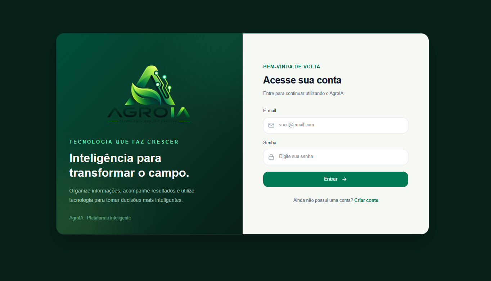
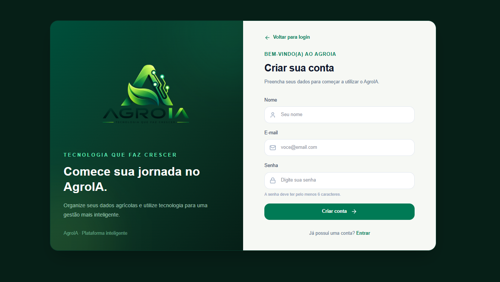
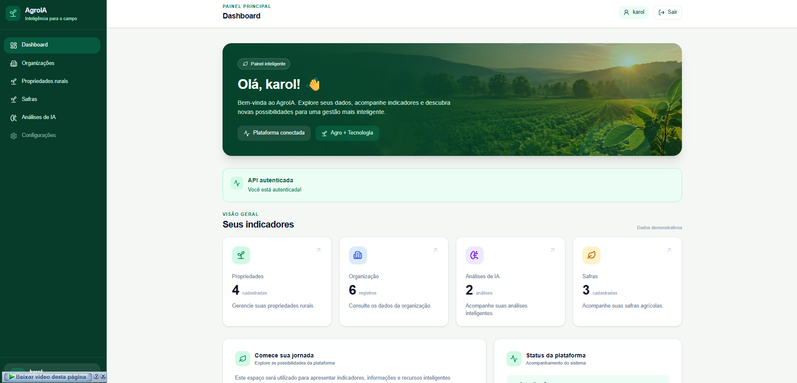
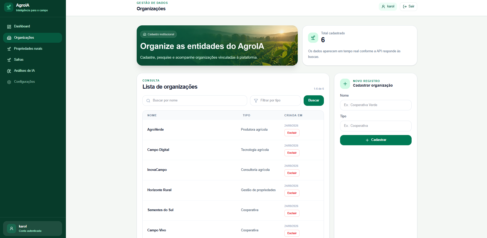
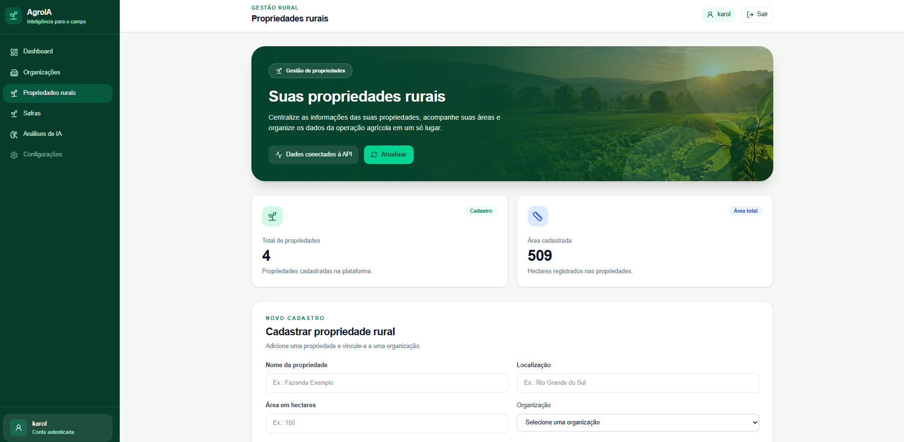
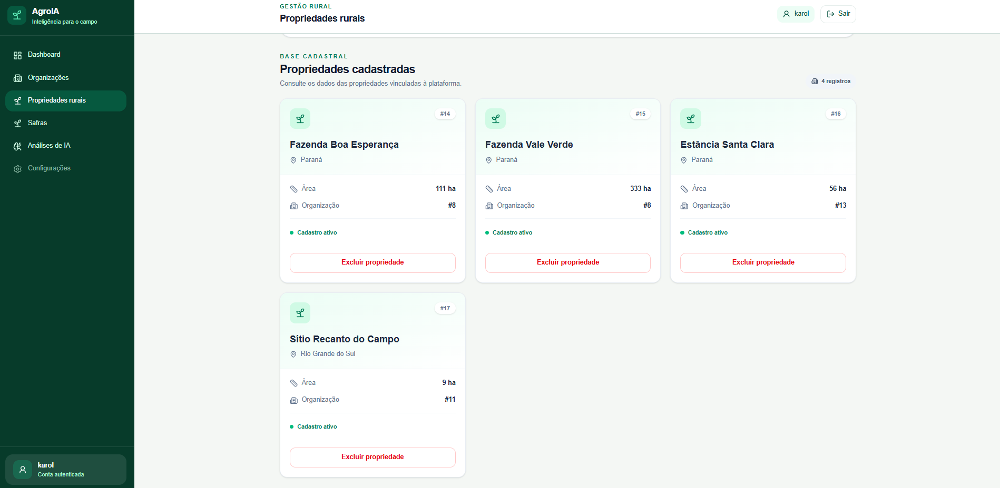
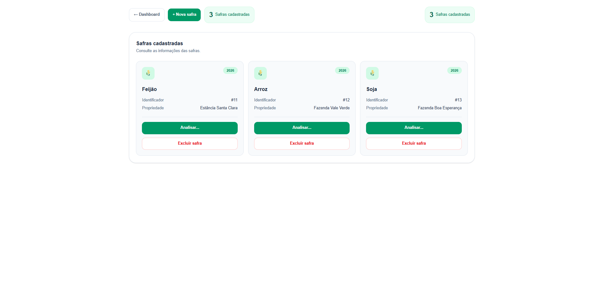
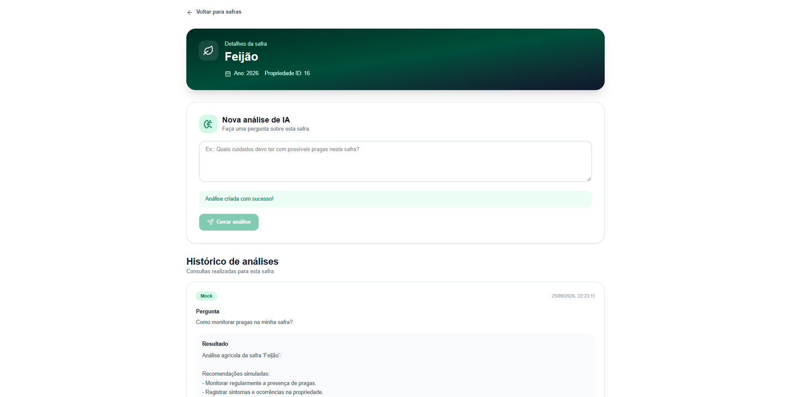
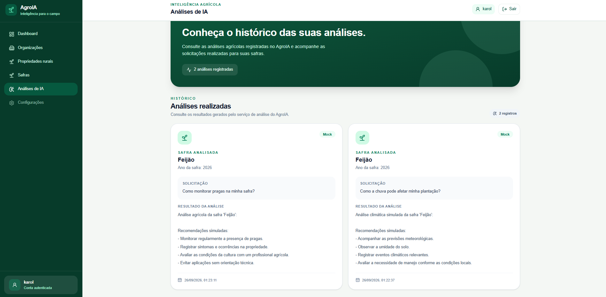

# AgroIA

> Plataforma de gestão agrícola em desenvolvimento, com foco em tecnologia, dados e inteligência artificial aplicada ao agronegócio.

---

## 🎯 Objetivo

Criar uma plataforma capaz de centralizar informações agrícolas e, futuramente, utilizar inteligência artificial e análise de dados para auxiliar na gestão e tomada de decisões.

O AgroIA está sendo desenvolvido de forma incremental, conectando uma aplicação web em React com uma API REST em ASP.NET Core e persistência de dados em SQL Server.

---

## 🚧 Status do projeto

**Em desenvolvimento**

O AgroIA está sendo construído gradualmente, com implementação das funcionalidades de forma incremental.

### Atualmente implementado

- 🔐 Autenticação e autorização
- 🏢 Gestão de organizações
- 🌾 Gestão de propriedades rurais
- 🌱 Cadastro e gerenciamento de safras
- 🗑️ Exclusão de safras
- 🤖 Análises de IA com serviço Mock
- 🔗 Integração entre frontend e API
- 🗄️ Persistência de dados com SQL Server
- 📚 API REST com ASP.NET Core
- ⚛️ Interface desenvolvida com React + TypeScript

---

## 🛠️ Tecnologias

### Frontend

- React
- TypeScript
- Vite
- Tailwind CSS

### Backend

- C#
- ASP.NET Core
- Entity Framework Core
- SQL Server

---

## 🏗️ Estrutura do projeto

```text
AgroIA/
│
├── .github/
│   └── workflows/
│
├── AgroIA.Api/
│   └── Backend da aplicação
│
├── frontend/
│   └── Aplicação React
│
├── docs/
│   └── images/
│       ├── login.png
│       ├── cadastro.png
│       ├── dashboard.png
│       ├── organizacoes.png
│       ├── propriedades.png
│       ├── propriedades-cadastradas.png
│       ├── safras.png
│       ├── analises-ia.png
│       └── analise-safra.png
│
├── .gitignore
├── PROJECT-STRUCTURE.md
└── README.md
```

---

# ▶️ Como rodar o projeto

## 📋 Pré-requisitos

Antes de executar o AgroIA, certifique-se de ter instalado:

- [.NET SDK](https://dotnet.microsoft.com/download)
- [Node.js](https://nodejs.org/)
- SQL Server
- Git

---

## 📥 1. Clonar o projeto

Clone o repositório:

```bash
git clone (https://github.com/karolrdg/Agro.IA.git)
```

Entre na pasta do projeto:

```bash
cd AgroIA
```

---

# 🔙 Backend

## 2. Acessar a API

Na raiz do projeto, entre na pasta do backend:

```bash
cd AgroIA.Api
```

---

## 3. Restaurar as dependências

Execute:

```bash
dotnet restore
```

---

## 4. Configurar o banco de dados

O AgroIA utiliza **SQL Server** com **Entity Framework Core**.

A conexão com o banco de dados deve ser configurada no arquivo:

```text
AgroIA.Api/appsettings.json
```

Exemplo:

```json
{
  "ConnectionStrings": {
    "DefaultConnection": "Server=localhost\\SQLEXPRESS;Database=AgroIADb;Trusted_Connection=True;TrustServerCertificate=True;"
  }
}
```

> Ajuste a connection string de acordo com a configuração do SQL Server da sua máquina.

---

## 5. Aplicar as migrations

Com o terminal dentro da pasta `AgroIA.Api`, execute:

```bash
dotnet ef database update
```

Caso o comando `dotnet ef` não esteja instalado:

```bash
dotnet tool install --global dotnet-ef
```

Depois execute:

```bash
dotnet ef database update
```

---

## 6. Executar o Backend

Execute:

```bash
dotnet run
```

A API estará disponível em:

```text
http://localhost:5194
```

### Principais endpoints

```text
/api/Users
/api/Organizations
/api/RuralProperties
/api/CropSeasons
/api/AIAnalyses
```

---

# ⚛️ Frontend

## 7. Abrir um novo terminal

Não feche o terminal onde o backend está executando.

Abra outro terminal e volte para a raiz do projeto:

```bash
cd ..
```

Depois entre na pasta do frontend:

```bash
cd frontend
```

---

## 8. Instalar as dependências

Execute:

```bash
npm install
```

---

## 9. Executar o Frontend

Execute:

```bash
npm run dev
```

O Vite exibirá no terminal o endereço da aplicação.

Normalmente:

```text
http://localhost:5173
```

Acesse esse endereço no navegador.

---

# 🔗 Comunicação entre Frontend e Backend

O frontend React se comunica com o backend através de uma API REST.

```text
┌─────────────────────────────┐
│       React + Vite          │
│     TypeScript + Tailwind   │
└──────────────┬──────────────┘
               │
               │ HTTP / REST
               ▼
┌─────────────────────────────┐
│       ASP.NET Core API      │
│            C#               │
└──────────────┬──────────────┘
               │
               │ Entity Framework Core
               ▼
┌─────────────────────────────┐
│         SQL Server          │
└─────────────────────────────┘
```

A URL base utilizada pela aplicação é:

```text
http://localhost:5194/api
```

---

# 🗄️ Banco de dados

O projeto utiliza **SQL Server** para persistência dos dados.

### Tecnologias utilizadas

- SQL Server
- Entity Framework Core
- Migrations

### Atualizar o banco

```bash
dotnet ef database update
```

### Criar uma nova migration

```bash
dotnet ef migrations add NomeDaMigration
```

---

# 📚 Swagger

Durante o desenvolvimento, a API possui documentação através do Swagger.

Com o backend executando, acesse:

```text
http://localhost:5194/swagger
```

O Swagger permite visualizar e testar os endpoints disponíveis na API.

---

# 🔐 Autenticação

O AgroIA possui autenticação e autorização.

O fluxo inicial da aplicação é:

```text
Cadastro
   ↓
Login
   ↓
Autenticação
   ↓
Dashboard
   ↓
Funcionalidades protegidas
```

Entre as funcionalidades protegidas estão recursos relacionados a:

- Organizações
- Propriedades rurais
- Safras
- Análises de IA

---

# 🏢 Organizações

A plataforma permite cadastrar e gerenciar organizações.

### Funcionalidades

- Cadastro de organizações
- Consulta de organizações
- Pesquisa por nome
- Filtro por tipo
- Exclusão de organizações

---

# 🌾 Propriedades rurais

A plataforma permite cadastrar propriedades rurais vinculadas a organizações.

As propriedades possuem informações como:

- Nome
- Localização
- Área em hectares
- Organização vinculada

Também é possível consultar e excluir propriedades cadastradas.

---

# 🌱 Safras

O AgroIA permite cadastrar e gerenciar safras associadas às propriedades rurais.

As safras possuem informações relacionadas a:

- Cultura
- Ano da safra
- Propriedade vinculada

Também é possível:

- Consultar safras
- Visualizar detalhes da safra
- Excluir safras
- Realizar análises relacionadas à safra

---

# 🤖 Inteligência Artificial

O AgroIA possui um módulo de análises agrícolas.

Atualmente, o sistema utiliza um serviço **Mock** para simular as respostas da inteligência artificial.

Essa abordagem permite desenvolver e testar o fluxo da funcionalidade sem depender de APIs externas ou serviços pagos.

### Categorias de análise

O serviço reconhece perguntas relacionadas a:

- 🐛 Pragas e doenças
- 🌧️ Clima e chuva
- 🌱 Plantio
- 🌾 Culturas agrícolas
- 📊 Acompanhamento da safra

### Exemplos de perguntas

```text
Como monitorar pragas na minha safra?

Como a chuva pode afetar minha plantação?

Quais cuidados devo ter durante o plantio?

Quais indicadores devo acompanhar?

Como acompanhar o desenvolvimento da cultura?
```

As análises geradas são armazenadas no banco de dados e podem ser consultadas posteriormente através do histórico.

---

# 📊 Dashboard

O Dashboard apresenta uma visão geral dos dados cadastrados na plataforma.

Atualmente são apresentados indicadores relacionados a:

- 🌾 Propriedades
- 🏢 Organizações
- 🤖 Análises de IA
- 🌱 Safras

Os dados são carregados através da API.

---

# 🖥️ Interface da aplicação

## 🔐 Login



---

## 📝 Cadastro de usuário



---

## 📊 Dashboard



---

## 🏢 Organizações



---

## 🌾 Cadastro de propriedades rurais



---

## 📋 Propriedades cadastradas



---

## 🌱 Safras



---

## 🤖 Análises de IA



---

## 🔎 Análise de uma safra



---

# 🚀 Próximos passos

O projeto continuará evoluindo com novas funcionalidades relacionadas a:

- 📊 Análise de dados agrícolas
- 🤖 Evolução dos recursos de inteligência artificial
- 📈 Indicadores e dashboards
- 🌦️ Informações climáticas
- 🌱 Monitoramento das safras
- 📋 Novos recursos para gestão agrícola

---

# 🧪 Ambiente de desenvolvimento

Atualmente, o projeto é executado localmente utilizando:

| Serviço | Endereço |
|---|---|
| Frontend | `http://localhost:5173` |
| Backend | `http://localhost:5194` |
| API | `http://localhost:5194/api` |
| Swagger | `http://localhost:5194/swagger` |

---

# 🌱 Sobre o projeto

O **AgroIA** busca unir:

```text
Agronegócio
     +
Tecnologia
     +
Dados
     +
Inteligência Artificial
```

A proposta é construir gradualmente uma plataforma capaz de centralizar informações agrícolas e disponibilizar recursos tecnológicos para auxiliar no acompanhamento e gestão das operações.

---

> 🚧 **AgroIA está em desenvolvimento.**
>
> Projeto desenvolvido com foco em aprendizado, evolução técnica e aplicação de tecnologia no agronegócio.
